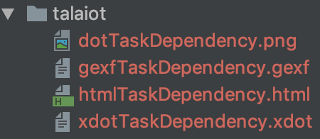
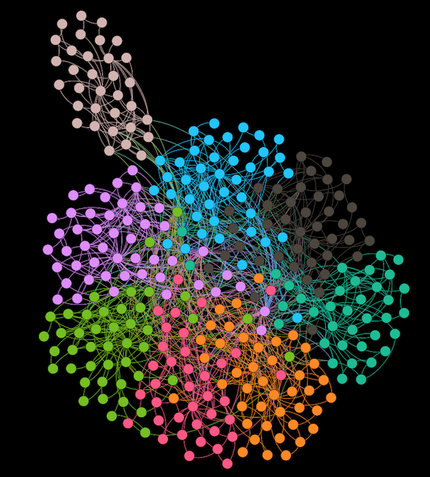
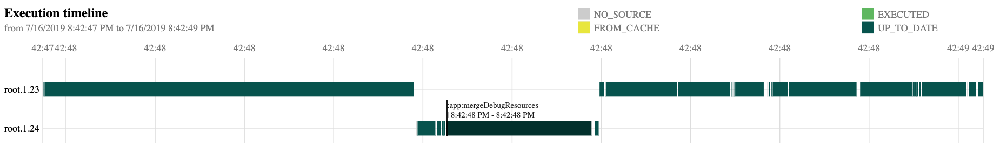

# Talaiot

[  ](https://bintray.com/cdsap/maven/talaiot/1.0.7/link)
[](https://circleci.com/gh/cdsap/Talaiot/tree/master)
[](https://codecov.io/gh/cdsap/Talaiot)

Talaiot is a simple and extensible plugin targeting teams using Gradle Build System.
It records the duration of your Gradle tasks helping to understand problems of the build and detecting bottlenecks. For every record, it will add additional information defined by default or custom metrics. 

Some of the features are:

* Integration with Time/Series systems like InfluxDb, ElasticSearch and Prometheus.
* Extensible definition of metrics depending on the requirements.
* Definition of custom publishers
* Develop it entirely with Kotlin 
* Generation Task Dependency Graph for the build


**_What is Talaiot?_**

_"... while some certainly had a defensive purpose, the use of others is not clearly understood. Some believe them to have served the purpose of lookout or signalling towers..."_

https://en.wikipedia.org/wiki/Talaiot

# Table of Contents
1. [Setup Plugin](#setup-plugin)
2. [Snapshots](#snapshots)
3. [Basic Configuration](#basic-configuration)
4. [Talaiot Extension](#talaiot-extension)
5. [Example: Analyzing Data provided by Talaiot](#example)
6. [Other Plugins](#plugins)
7. [Docs](#docs)
8. [Articles](#articles)
9. [Contributing](#contributing)
10. [Contributors](#contributors)
11. [Thanks](#thanks)

## Setup Plugin <a name="setup-plugin"></a>

Include in the classpath the latest version of Talaiot:
````
classpath("com.cdsap:talaiot:<latest_version>")
````

Apply the plugin:

````
plugins {
    id("talaiot")
}
````

Check [this](https://github.com/cdsap/Talaiot/wiki/Groovy-setup) article to see how to setup Talaiot with  Groovy(all the examples in the README are in KTS.


## Snapshots  <a name="snapshots"></a>

Include the OJO artifactory oss-snapshot local:
````
maven ( url = uri("http://oss.jfrog.org/artifactory/oss-snapshot-local") )
````
And the current Snapshot:

````
classpath("com.cdsap:talaiot:1.0.8-SNAPSHOT")
````

## Basic configuration  <a name="basic-configuration"></a>

````
talaiot {
    publishers {
        influxDbPublisher {
            dbName = "tracking"
            url = "http://localhost:8086"
            taskMetricName = "task"
            buildMetricName = "build"
        }

    }
    filter {
        threshold {
            minExecutionTime = 10
        }
    }
}
````
This example adds the `InfluxDbPublisher` with the information of the InfluxDb Server where it will be posted the information tracked.
Additionally, we are disabling the metrics for Git and Performance.

## Talaiot Extension  <a name="talaiot-extension"></a>

| Property       |      Description                                                          |
|----------------|---------------------------------------------------------------------------|
| logger         | Mode for logging (Silent,Info)                                            |
| ignoreWhen     | Configuration to ignore the execution of Talaiot                          |
| generateBuildId| Generation of unique identifier for each execution(disabled by default)   |
| publishers     | Configuration to define where to submit the information of the build      |
| metrics        | Additional information tracked during the execution of the task           |
| filter         | Rules to filter the tasks to be reported                                  |

    
### Publishers
In terms of publishing Talaiot includes some default Publishers, but at the same time 
you can extend it and create your publisher for your requirements

#### Predefined Publishers
 

| Property                      |      Description                                                                                           |
|------------------------------ |------------------------------------------------------------------------------------------------------------|
| OutputPublisher               | Publish the results of the build on the console, this Publisher will only print the task name and duration |
| InfluxDbPublisher             | Publish the results of the build to the InfluxDb database defined in the configuration                     |
| TaskDependencyGraphPublisher  | Publish the results of the build using the dependency graph of the tasks executed                          |
| PushGatewayGraphPublisher     | Publish the results of the build to the PushGateway server defined in the configuration                    |
| JsonPublisher                 | Publish the results of the build with a json format                                                        |
| TimelinePublisher             | Publish the results of the build decomposed by the different workers used in the execution                 |
| ElasticSearchPublisher        | Publish the results of the build to the ElasticSearch instance defined in the configuration                |
| HybridPublisher               | Publish the results of the build in two different publishers defined for tasks metrics and build metrics   |


#### InfluxDbPublisher
Talaiot will send to the InfluxDb server defined in the configuration the values collected during the execution


| Property                     |      Description                                                                    |
|----------------------------- |-------------------------------------------------------------------------------------|
| dbName                       | Name of the database                                                                |
| url                          | Url of the InfluxDb Server                                                          |
| taskMetricName               | Name of the metric used for specific task in the execution                          |
| buildMetricName              | Name of the metric used for the overall information of the build in the execution   |
| username                     | username which is used to authorize against the influxDB instance (optional)        |
| password                     | password for the username which is used to authorize against the influxDB (optional)|                                                                          |
| retentionPolicyConfiguration | retention policy which is used for writing points                                   |
| publishBuildMetrics          | Publish build metrics of the publisher, true by default                             |
| publishTaskMetrics           | Publish tasks metrics of the publisher, true by default                             |


##### RetentionPolicyConfiguration

Retention Policy (RP) describes how long InfluxDB keeps data, how many copies of the data to store in the cluster,
and the time range covered by shard groups. RPs are unique per database and along with the measurement and tag set define a series.
Since version 1.0.0 we are including by default RP in all the operations included in the publisher. The `RetentionPolicyConfiguration` includes:


| Property                     |      Description                                                           |
|----------------------------- |----------------------------------------------------------------------------|
| name                         | name of the retentionPolicy(rp). Default `rpTalaiot`                       |
| duration                     | duration of the rp. Default `30d`                                          |
| shardDuration                | the shardDuration. Default `30m`                                           |
| replicationFactor            | the replicationFactor of the rp. Default `2`                               |
| isDefault                    | if the rp is the default rp for the database or not. Default `false`       |

Example of custom RP Configuration:

```
influxDbPublisher {
  dbName = "xxxxxx"
  url = "xxxxxx"
  retentionPolicyConfiguration {
    name = "customRp"
    duration = "4w"
    shardDuration = "30m"
    replicationFactor = 1
    isDefault = true
  }
}
```

#### TaskDependencyGraphPublisher
Talaiot will generate the Task Dependency Graph in the specific format specified in the configuration


| Property      |      Description                                                                                 |
|---------------|--------------------------------------------------------------------------------------------------|
| ignoreWhen    | Configuration to ignore the execution of the publisher                                           |
| html          | Export the task dependency graph in Html format with support of [vis.js](http://visjs.org/)      |
| gexf          | Export the task dependency graph in [gexf format](https://gephi.org/gexf/format/)                |
| dot           | Export the task dependency graph in png format. See [Graphviz](https://graphviz.gitlab.io/) |

This new category of publishers does not require constantly evaluating the builds, that's why there is an extra
parameter configuration in the Publisher to ignore the execution unless there is some property enabled. Typical use case is 
use this publisher and collect the files on CI.

The output will be found `"${project.rootDir}/talaiot`:

 

Example:

 

#### PushGatewayPublisher
Talaiot will send to the PushGateway server defined in the configuration the values collected during the execution.


| Property             |      Description                                                                  |
|--------------------- |-----------------------------------------------------------------------------------|
| url                  | Url of the PushGateway Server                                                     |
| taskJobName          | Name of the job required for the tasks metrics to be exported to Prometheus       |
| buildJobName         | Name of the job required for the build metrics to be exported to Prometheus       |
| publishBuildMetrics  | Publish build metrics of the publisher, true by default                           |
| publishTaskMetrics   | Publish tasks metrics of the publisher, true by default                           |


#### JsonPublisher
Talaiot will Publish the results of the build with a json format .

```
    publishers {
        jsonPublisher = true
   
    }
```

#### TimelinePublisher
Talaiot will create a PNG file with the detailed information in chronological order by task of the execution
in the different workers.



```
    publishers {
        timelinePublisher = true
   
    }
```

#### ElasticSearchPublisher
Talaiot will send to the ElasticSearch server defined in the configuration the values collected for tasks and build metrics during the execution
in the different workers.

| Property             |      Description                                                                  |
|--------------------- |-----------------------------------------------------------------------------------|
| url                  | ElasticSearch server                                                              |
| taskIndexName        | Name for the index used to report tasks metrics                                   |
| buildIndexName       | Name for the index used to report build metrics                                   |
| publishBuildMetrics  | Publish build metrics of the publisher, true by default                           |
| publishTaskMetrics   | Publish tasks metrics of the publisher, true by default                           |

Example:

```
    publishers {
        elasticSearchPublisher {
          url = "http://localhost:9200"
          taskIndexName = "task"
          buildIndexName = "build"
        }
    }
```

#### HybridPublisher
This Publisher allows composition over publishers to report tasks and build metrics.

| Property             |      Description                                                                  |
|--------------------- |-----------------------------------------------------------------------------------|
| taskPublisher        | Publisher configuration used to publish tasks metrics                             |
| buildPublisher       | Publisher configuration used to publish build metrics                             |


Example:

```
    publishers {
        hybridPublisher {
            taskPublisher = ElasticSearchPublisherConfiguration().apply {
                url = "http://localhost:9200"
                buildIndexName = "build"
                taskIndexName = "task"
            }
            
            buildPublisher = InfluxDbPublisherConfiguration().apply {
                dbName = "tracking"
                url = "http://localhost:8086"
                buildMetricName = "build"
                taskMetricName = "task"
            }
        }
    }
```
In this example we are using `InfluxDbPublisher` to report build metrics and `ElasticSearchPublisher` to report task metrics. 
 

#### Custom Publishers
Talaiot allows using custom Publishers defined by the requirements of your environment, in case you are using another implementation.
Check [here](https://github.com/cdsap/Talaiot/wiki/Publishers#custompublisher) how to define a custom publisher

### Metrics
We can include extra information on the build and task tracked data during the build. This information will be added to the default metrics defined.

````
talaiot {
    metrics {
       customBuildMetrics ("versionApp" to $version)
       customTaskMetrics ("versionApp" to $version, "customProperty" to getCustomProperty())
    }
}
````
 
 ### Filters
 For every measurement done, Talaiot can filter the tasks tracked to be published. These filters don't apply to GraphPublishers:
 
 
 | Property      |      Description                                                                           |
 |---------------|--------------------------------------------------------------------------------------------|
 | tasks         |Configuration used to filter which tasks we want to exclude and include in the execution    |
 | module        |Configuration used to filter which modules we want to exclude and include in the execution  |
 | threshold     |Configuration used to define time execution ranges to filter tasks to be reported           |
 
 
 Example:
 ```
  filter {
      tasks {
          excludes = arrayOf("preDebugBuild", "processDebugResources")
      }
      modules {
          excludes = arrayOf(":app")
      }
      threshold {
          minExecutionTime = 10
      }
  }
 ```

 
 ### IgnoreWhen

| Property   |      Description      |
|----------- |-----------------------|
| envName    |Name of the Property   |
| envValue   |Value of the Property  |

We will use IgnoreWhen when we want to ignore publishing the results of the build. One use case is to ignore it when we 
are building on CI:

````
talaiot {
    ignoreWhen {
        envName = "CI"
        envValue = "true"
    }
}
````

               
## Example: Analyzing Data provided by Talaiot  <a name="example"></a>

### Docker, InfluxDb and Grafana
To have a quick setup to see the possibilities of `Talaiot` we are providing a Docker image to setup a Grafana + InfluxDb instances(based on [this](https://github.com/philhawthorne/docker-influxdb-grafana) great repo).  

Additionally, the Docker image is creating a default database, a provisioned dashboard and the default datasource for InfluxDb.
The source is [here](docker/Dockerfile):

To run the Docker Image:
```sh
docker run -d \
  -p 3003:3003 \
  -p 3004:8083 \
  -p 8086:8086 \
  -p 22022:22 \
  -v /var/lib/influxdb \
  -v /var/lib/grafana \
  cdsap/talaiot:latest
```
  
You can access to the local instance of Grafana:

`http://localhost:3003` root/root
    
### Populating data 
If you access to the provisioned Dashboard included in the Docker Image(http://localhost:3003/d/F9jppxQiz/android-task-tracking?orgId=1), you will see an empty dashboard like:


To see Talaiot in action, you need to populate the data. We are providing a script to populate data based in the sample project included in the repository. 
You can execute the script:

`bash scripts/populate.sh `

The script will download the repository and with the help of Gradle Profiler(https://github.com/gradle/gradle-profiler) 
will trigger number of builds defined in the scenario file:

```
assemble {
  tasks = ["clean"]
}
clean_build {
  versions = ["5.1"]
  tasks = ["assembleDebug"]
  gradle-args = ["--parallel"]
  cleanup-tasks = ["clean"]
  run-using = cli
  warm-ups = 20
}
```

Once is finished you can check the results on the Grafana Dashboard http://localhost:3003/d/F9jppxQiz/android-task-tracking?orgId=1:


## Other Plugins  <a name="plugins"></a>
Talaiot is not a new idea. There are multiple awesome plugins to use to achieve same results:

* [Gradle Enterprise](https://gradle.com/#): If you are using Gradle Enterprise Talaiot is useless because the aggregation 
is great and you have the support from Gradle :) 

* [Build Time Tracker](https://github.com/passy/build-time-tracker-plugin) by Pascal Hartig(@passy).

* [Kuronometer](https://github.com/pedrovgs/Kuronometer) Plugin developed with Scala and FP concepts by Pedro Vicente Gómez Sánchez(@pedrovgs)

## Docs  <a name="docs"></a>

[Docs](https://cdsap.github.io/Talaiot/)

## Articles  <a name="articles"></a>
 
[Understanding Talaiot](https://proandroiddev.com/understanding-talaiot-5da62594b00c)
 
[Exploring the InfluxDbPublisher in Talaiot](https://proandroiddev.com/exploring-the-influxdbpublisher-in-talaiot-ae6c60a0b0ec)

[Graphs, Gradle and Talaiot](https://proandroiddev.com/graphs-gradle-and-talaiot-b0c02c50d2b1)

[Talaiot at Scale](https://proandroiddev.com/talaiot-at-scale-8cb5259d3244)


## Contributing  <a name="contributing"></a>
Talaiot is Open Source and accepts contributions of new Publishers, Metrics and Dashboards that we can include as provisioned ones in the Docker image.

## Contributors  <a name="contributors"></a>

* [Anton Malinskiy](https://github.com/Malinskiy): New format metrics, rework InfluxdbPublisher and new Publishers Json and Timeline.

* [Vipul Solanki](https://github.com/vipsy)

* [Ivan Balaksha](https://github.com/tagantroy)

* [Sergey Rybalkin](https://github.com/rybalkinsd)

* [Satyarth Sampath](https://github.com/satyarths)

* [Iñaki Villar](https://github.com/cdsap/)


## Thanks  <a name="thanks"></a>
Pascal Hartig, [Build Time Tracker](https://github.com/passy/build-time-tracker-plugin) it was an inspiration to build this plugin.

[Bintray release plugin](https://github.com/novoda/bintray-release) plugin by Novoda

[Kohttp Library](https://github.com/rybalkinsd/kohttp)

[Graphviz-java Library](https://github.com/nidi3/graphviz-java)

[Orchid](https://orchid.netlify.com/)
