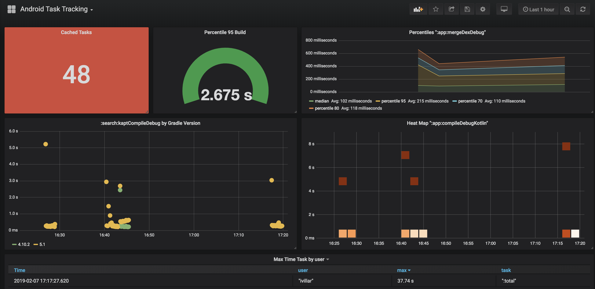
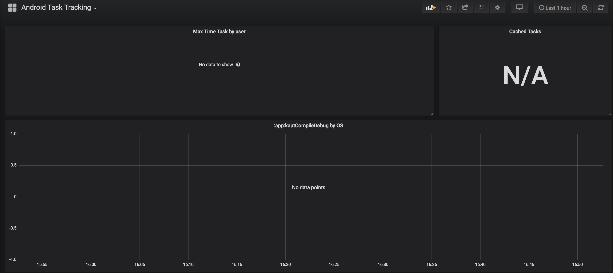
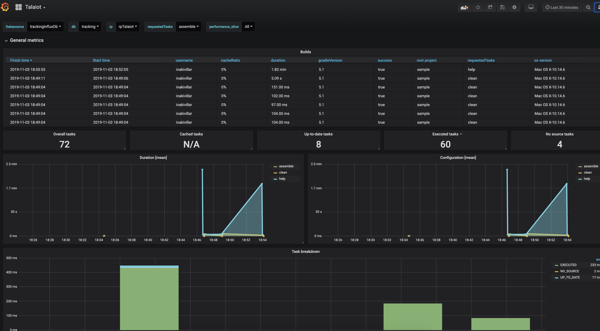
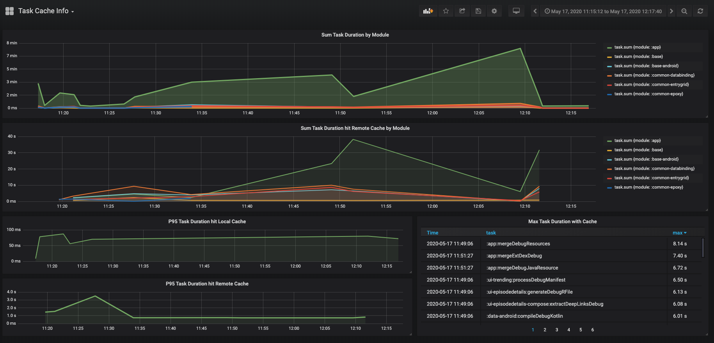

# Talaiot

[](https://circleci.com/gh/cdsap/Talaiot/tree/master)
[](https://codecov.io/gh/cdsap/Talaiot)

Talaiot is an extensible library targeting teams using the Gradle Build System.
It records build/task duration helping to understand problems of the build and detecting bottlenecks. For every record, it will add additional information defined by default or custom metrics.

Talaiot is compatible with different systems like InfluxDb, Elasticsearch or RethinkDb. You need to use a Plugin to work with Talaiot.
You can use the standard plugin, including all the functionality, or if you have a specific requirement with a individual plugin.

Current available plugins:

| Plugin         |      Description                                                          |
|----------------|---------------------------------------------------------------------------|
| standard       | Contains all the available publishers listed below                        |
| base           | Talaiot core functionality with Json, Output and Timeline publishers     |
| elasticsearch  | Talaiot core functionality with Elasticsearch publisher                  |
| influxdb       | Talaiot core functionality with Influxdb publisher                       |
| pushgateway    | Talaiot core functionality with Pushgateway publisher                    |
| rethinkdb      | Talaiot core functionality with Rethinkdb publisher                      |

Once you have Talaiot integrated you can create dashboards using the build information stored:



**_What is Talaiot?_**

_"... while some certainly had a defensive purpose, the use of others is not clearly understood. Some believe them to have served the purpose of lookout or signalling towers..."_

https://en.wikipedia.org/wiki/Talaiot

# Table of Contents
1. [Setup](#setup)
2. [Snapshots](#snapshots)
3. [Talaiot Extension](#talaiot-extension)
4. [Samples](#samples)
5. [Example: Analyzing Data provided by Talaiot](#example)
6. [Other Existing Libraries](#other_libraries)
7. [Articles](#articles)
8. [Contributing](#contributing)
9. [Contributors](#contributors)
10. [Thanks](#thanks)

## Setup <a name="setup"></a>

### Standard Plugin
#### Kotlin
Using the plugins DSL:
```
plugins {
  id("io.github.cdsap.talaiot") version "1.5.1"
}
```

Using legacy plugin application:
```
buildscript {
  repositories {
    maven {
      url = uri("https://plugins.gradle.org/m2/")
    }
  }
  dependencies {
    classpath("io.github.cdsap:talaiot:1.5.1")
  }
}

apply(plugin = "io.github.cdsap.talaiot")
```

#### Groovy
Using the plugins DSL:
```
plugins {
  id "io.github.cdsap.talaiot" version "1.5.1"
}

```

Using legacy plugin application:
```
buildscript {
  repositories {
    maven {
      url "https://plugins.gradle.org/m2/"
    }
  }
  dependencies {
    classpath "io.github.cdsap:talaiot:1.5.1"
  }
}

apply plugin: "io.github.cdsap.talaiot"
```

### Individual Plugins

Each plugin is deployed to the Gradle Plugin Portal using thee following convention:

| Plugin         |      Id                                 |
|----------------|-----------------------------------------|
| base           | io.github.cdsap.talaiot.plugin.base           |
| elasticsearch  | io.github.cdsap.talaiot.plugin.elasticsearch  |
| influxdb       | io.github.cdsap.talaiot.plugin.influxdb       |
| pushgateway    | io.github.cdsap.talaiot.plugin.pushgateway    |
| rethinkdb      | io.github.cdsap.talaiot.plugin.rehinkdb       |


#### Kotlin Example Plugin
Using the plugins DSL:
```
plugins {
  id("io.github.cdsap.talaiot.plugin.base") version "1.5.1"
}
```

Using legacy plugin application:
```
buildscript {
  repositories {
    maven {
      url = uri("https://plugins.gradle.org/m2/")
    }
  }
  dependencies {
    classpath("io.github.cdsap.talaiot.plugin:base:1.5.1")
  }
}

apply(plugin = "io.github.cdsap.talaiot.plugin.base")
```

#### Groovy
Using the plugins DSL:
```
plugins {
  id "io.github.cdsap.talaiot.plugin.base" version "1.5.1"
}

```

Using legacy plugin application:
```
buildscript {
  repositories {
    maven {
      url "https://plugins.gradle.org/m2/"
    }
  }
  dependencies {
    classpath "io.github.cdsap.talaiot.plugin:base:1.5.1"
  }
}

apply plugin: "io.github.cdsap.talaiot.plugin.base"
```


## Snapshots  <a name="snapshots"></a>

````
maven ( url = uri("https://s01.oss.sonatype.org/content/repositories/snapshots/") )
````
### Standard Plugin

````
classpath("io.github.cdsap:talaiot:2.0.0-SNAPSHOT")
````
### Individual Plugin

````
classpath("io.github.cdsap.talaiot.plugin:base:2.0.0-SNAPSHOT")
````

## Talaiot Extension  <a name="talaiot-extension"></a>

| Property       |      Description                                                          |
|----------------|---------------------------------------------------------------------------|
| logger         | Mode for logging (Silent,Info)                                            |
| ignoreWhen     | Configuration to ignore the execution of Talaiot                          |
| generateBuildId| Generation of unique identifier for each execution(disabled by default)   |
| publishers     | Configuration to define where to submit the information of the build      |
| metrics        | Additional information tracked during the execution of the task           |
| filter         | Rules to filter the build or the tasks to be reported                     |
### Metrics
We can include extra information on the build and task tracked data during the build. This information will be added to the default metrics defined.

```
talaiot {
    metrics {
        // You can add your own custom Metric objects:
        customMetrics(
            MyCustomMetric(),
            // Including some of the provided metrics, individually.
            HostnameMetric()
        )

        // Or define build or task metrics directly:
        customBuildMetrics(
            "kotlinVersion" to $kotlinVersion,
            "javaVersion" to $javaVersion
        )
        customTaskMetrics(
            "customProperty" to $value
        )
    }
}
```

Read more about it in the [Metrics wiki page](https://github.com/cdsap/Talaiot/wiki/Metrics).

### Filters
For every measurement done, Talaiot can filter the tasks tracked to be published.


 | Property             |      Description                                                                             |
 |----------------------|----------------------------------------------------------------------------------------------|
 | tasks                |Configuration used to filter which tasks we want to exclude and include in the execution      |
 | module               |Configuration used to filter which modules we want to exclude and include in the execution    |
 | threshold            |Configuration used to define time execution ranges to filter tasks to be reported             |

 For every measurement done, Talaiot can completely skip publishing process. These filters affect all publishers:

 | Property             |      Description                                                                             |
 |----------------------|----------------------------------------------------------------------------------------------|
 | build.success        |Configuration used to skip publishing based on build success.                                 |
 | build.requestedTasks |Configuration used to skip publishing based on what was the requested task.                   |


 Example:
 ```
  filter {
      tasks {
          excludes = arrayOf("preDebugBuild", "processDebugResources")
      }
      modules {
          excludes = arrayOf(":app")
      }
      threshold {
          minExecutionTime = 10
      }
      build {
          success = true
          requestedTasks {
              includes = arrayOf(":app:assemble.*")
              excludes = arrayOf(":app:generate.*")
          }
      }
  }
 ```


### IgnoreWhen

| Property   |      Description      |
|----------- |-----------------------|
| envName    |Name of the Property   |
| envValue   |Value of the Property  |

We will use IgnoreWhen when we want to ignore publishing the results of the build. One use case is to ignore it when we
are building on CI:

````
talaiot {
    ignoreWhen {
        envName = "CI"
        envValue = "true"
    }
}
````


### Publishers configuration  <a name="talaiot-extension"></a>
The Publisher configuration will change depending on the type of plugin you are using. Standard Plugin provides
all the different publisher configurations, for example:
```
talaiot {
    publishers {
        influxDbPublisher {
            dbName = "tracking"
            url = "http://localhost:8086"
            taskMetricName = "task"
            buildMetricName = "build"
        }

    }
    filter {
        threshold {
            minExecutionTime = 10
        }
    }
}
```
This configuration would be valid for the InfluxDb Plugin.

#### InfluxDbPublisher
Talaiot will send to the InfluxDb server defined in the configuration the values collected during the execution


| Property                     |      Description                                                                    |
|----------------------------- |-------------------------------------------------------------------------------------|
| dbName                       | Name of the database                                                                |
| url                          | Url of the InfluxDb Server                                                          |
| taskMetricName               | Name of the metric used for specific task in the execution                          |
| buildMetricName              | Name of the metric used for the overall information of the build in the execution   |
| username                     | username which is used to authorize against the influxDB instance (optional)        |
| password                     | password for the username which is used to authorize against the influxDB (optional)|                                                                          |
| retentionPolicyConfiguration | retention policy which is used for writing points                                   |
| publishBuildMetrics          | Publish build metrics of the publisher, true by default                             |
| publishTaskMetrics           | Publish tasks metrics of the publisher, true by default                             |
| buildTags                    | Collection of BuildMetrics used as tags                                             |
| taskTags                     | Collection of TaskMetrics used as tags                                              |

For complete list of 
- build tags check: https://github.com/cdsap/Talaiot/blob/master/library/core/talaiot/src/main/kotlin/io/github/cdsap/talaiot/metrics/BuildMetrics.kt
- task tags check: https://github.com/cdsap/Talaiot/blob/master/library/core/talaiot/src/main/kotlin/io/github/cdsap/talaiot/metrics/TaskMetrics.kt

If you need to include custom metrics as tags, you need to use the type `Custom`

Included in: `io.github.cdsap.talaiot` and `io.github.cdsap.talaiot.plugin.influxdb` plugins.

#### InfluxDb2Publisher
Talaiot will send to the InfluxDb (Flux) server defined in the configuration the values collected during the execution


| Property                     |      Description                                                                    |
|----------------------------- |-------------------------------------------------------------------------------------|
| token                        | Influx access token                                                                |
| url                          | Url of the InfluxDb Server                                                          |
| taskMetricName               | Name of the metric used for specific task in the execution                          |
| buildMetricName              | Name of the metric used for the overall information of the build in the execution   |
| org                          | Organization name                                                                   |
| bucket                       | Name of bucket                                                                      |
| publishBuildMetrics          | Publish build metrics of the publisher, true by default                             |
| publishTaskMetrics           | Publish tasks metrics of the publisher, true by default                             |
| buildTags                    | Collection of BuildMetrics used as tags                                             |
| taskTags                     | Collection of TaskMetrics used as tags                                              |

Included in: `io.github.cdsap.talaiot` and `io.github.cdsap.talaiot.plugin.influxdb2` plugins.

##### RetentionPolicyConfiguration

Retention Policy (RP) describes how long InfluxDB keeps data, how many copies of the data to store in the cluster,
and the time range covered by shard groups. RPs are unique per database and along with the measurement and tag set define a series.
Since version 1.0.0 we are including by default RP in all the operations included in the publisher. The `RetentionPolicyConfiguration` includes:


| Property                     |      Description                                                           |
|----------------------------- |----------------------------------------------------------------------------|
| name                         | name of the retentionPolicy(rp). Default `rpTalaiot`                       |
| duration                     | duration of the rp. Default `30d`                                          |
| shardDuration                | the shardDuration. Default `30m`                                           |
| replicationFactor            | the replicationFactor of the rp. Default `2`                               |
| isDefault                    | if the rp is the default rp for the database or not. Default `false`       |

Example of custom RP Configuration:

```
influxDbPublisher {
  dbName = "xxxxxx"
  url = "xxxxxx"
  retentionPolicyConfiguration {
    name = "customRp"
    duration = "4w"
    shardDuration = "30m"
    replicationFactor = 1
    isDefault = true
  }
}
```


#### PushGatewayPublisher
Talaiot will send to the PushGateway server defined in the configuration the values collected during the execution.


| Property             |      Description                                                                  |
|--------------------- |-----------------------------------------------------------------------------------|
| url                  | Url of the PushGateway Server                                                     |
| taskJobName          | Name of the job required for the tasks metrics to be exported to Prometheus       |
| buildJobName         | Name of the job required for the build metrics to be exported to Prometheus       |
| publishBuildMetrics  | Publish build metrics of the publisher, true by default                           |
| publishTaskMetrics   | Publish tasks metrics of the publisher, true by default                           |

Included in: `io.github.cdsap.talaiot` and `io.github.cdsap.talaiot.plugin.pushgateway` plugins.

#### JsonPublisher
Talaiot will Publish the results of the build with a json format .

```
    publishers {
        jsonPublisher = true

    }
```

Included in: `io.github.cdsap.talaiot` and `io.github.cdsap.talaiot.plugin.base` plugins.

#### ElasticSearchPublisher
Talaiot will send to the ElasticSearch server defined in the configuration the values collected for tasks and build metrics during the execution
in the different workers.

| Property             |      Description                                                                  |
|--------------------- |-----------------------------------------------------------------------------------|
| url                  | ElasticSearch server                                                              |
| taskIndexName        | Name for the index used to report tasks metrics                                   |
| buildIndexName       | Name for the index used to report build metrics                                   |
| publishBuildMetrics  | Publish build metrics of the publisher, true by default                           |
| publishTaskMetrics   | Publish tasks metrics of the publisher, true by default                           |

Example:

```
    publishers {
        elasticSearchPublisher {
          url = "http://localhost:9200"
          taskIndexName = "task"
          buildIndexName = "build"
        }
    }
```
Included in: `io.github.cdsap.talaiot` and `io.github.cdsap.talaiot.plugin.elasticsearch` plugins.

#### HybridPublisher
This Publisher allows composition over publishers to report tasks and build metrics.

| Property             |      Description                                                                  |
|--------------------- |-----------------------------------------------------------------------------------|
| taskPublisher        | Publisher configuration used to publish tasks metrics                             |
| buildPublisher       | Publisher configuration used to publish build metrics                             |


Example:

```
    publishers {
        hybridPublisher {
            taskPublisher = ElasticSearchPublisherConfiguration().apply {
                url = "http://localhost:9200"
                buildIndexName = "build"
                taskIndexName = "task"
            }

            buildPublisher = InfluxDbPublisherConfiguration().apply {
                dbName = "tracking"
                url = "http://localhost:8086"
                buildMetricName = "build"
                taskMetricName = "task"
            }
        }
    }
```
In this example we are using `InfluxDbPublisher` to report build metrics and `ElasticSearchPublisher` to report task metrics.

Included in: `io.github.cdsap.talaiot` plugin.

#### RethinkDbPublisher
Talaiot will send to the RethinkDb server defined in the configuration the values collected during the execution


| Property                     |      Description                                                                      |
|----------------------------- |---------------------------------------------------------------------------------------|
| dbName                       | Name of the database                                                                  |
| url                          | Url of the RethinkDb Server                                                           |
| taskTableName                | Name of the table used to track tasks information                                     |
| buildTableName               | Name of the table used to track the build information                                 |
| username                     | username which is used to authorize against the RethinkDb instance (optional)         |
| password                     | password for the username which is used to authorize against the RethinkDb (optional) |                                                                          |
| publishBuildMetrics          | Publish build metrics of the publisher, true by default                               |
| publishTaskMetrics           | Publish tasks metrics of the publisher, true by default                               |

Included in: `io.github.cdsap.talaiot` and `io.github.cdsap.talaiot.plugin.rethinkdb` plugins.


## Sample  <a name="sample"></a>
Folder `sample` contains a Gradle project using Talaiot:
```
cd sample
./gradlew assemble
```

## Example: Analyzing Data provided by Talaiot <a name="example"></a>

### Docker, InfluxDb and Grafana
To have a quick setup to see the possibilities of `Talaiot` we are providing a Docker image to setup a Grafana + InfluxDb instances(based on [this](https://github.com/philhawthorne/docker-influxdb-grafana) great repo).  

Additionally, the Docker image is creating a default database, a provisioned dashboard and the default datasource for InfluxDb.
The source is [here](docker/Dockerfile):

To run the Docker Image:
```sh
docker run -d \
  -p 3003:3003 \
  -p 3004:8083 \
  -p 8086:8086 \
  -p 22022:22 \
  -v /var/lib/influxdb \
  -v /var/lib/grafana \
  cdsap/talaiot:latest
```

You can access to the local instance of Grafana:

`http://localhost:3003` root/root

### Populating data
If you access to the provisioned Dashboards included in the Docker Image(http://localhost:3003/d/F9jppxQiz/android-task-tracking?orgId=1 and http://localhost:3003/d/WlpZEBRMz/task-cache-info?orgId=1), you will see an empty dashboard like:



To see Talaiot in action, you need to populate the data. We are providing a script to populate data based in the sample project included in the repository.
You can execute the script:

`bash scripts/populate.sh `

The script will download the repository and with the help of Gradle Profiler(https://github.com/gradle/gradle-profiler)
will trigger number of builds defined in the scenario file:

```
assemble {
  tasks = ["clean"]
}
clean_build {
  versions = ["5.1"]
  tasks = ["assemble"]
  gradle-args = ["--parallel"]
  cleanup-tasks = ["clean"]
  run-using = cli
  warm-ups = 20
}
```

Once is finished you can check the results on the Grafana Dashboard http://localhost:3003/d/F9jppxQiz/android-task-tracking?orgId=1:


Additionally, we have included a new Dashboard to show how to work with the Caching information of the task execution:



http://localhost:3003/d/WlpZEBRMz/task-cache-info?orgId=1


## Other Existing Libraries  <a name="other_libraries"></a>
Talaiot is not a new idea. There are multiple awesome plugins to use to achieve same results:

* [Gradle Enterprise](https://gradle.com/#): If you are using Gradle Enterprise Talaiot is useless because the aggregation
is great and you have the support from Gradle :)

* [Build Time Tracker](https://github.com/passy/build-time-tracker-plugin) by Pascal Hartig(@passy).

* [Kuronometer](https://github.com/pedrovgs/Kuronometer) Plugin developed with Scala and FP concepts by Pedro Vicente Gómez Sánchez(@pedrovgs)

## Articles  <a name="articles"></a>

[🇹🇭 มาทำความรู้จักกับโปรเจค Android ของเราให้มากขึ้นดีกว่า (part 2)](https://kajornsakp.medium.com/understanding-your-android-projects-part-2-f37ef19f4aab) by [Kajornsak P.](https://github.com/kajornsakp)

[Metrics Configuration](https://medium.com/@mydogtom/explore-talaiot-plugin-configure-metrics-5ef3ae9a8c5d) by [Svyatoslav Chatchenko](https://github.com/MyDogTom)

[Understanding Talaiot](https://proandroiddev.com/understanding-talaiot-5da62594b00c)

[Exploring the InfluxDbPublisher in Talaiot](https://proandroiddev.com/exploring-the-influxdbpublisher-in-talaiot-ae6c60a0b0ec)

[Graphs, Gradle and Talaiot](https://proandroiddev.com/graphs-gradle-and-talaiot-b0c02c50d2b1)

[Talaiot at Scale](https://proandroiddev.com/talaiot-at-scale-8cb5259d3244)


## Contributing  <a name="contributing"></a>
Talaiot is Open Source and accepts contributions of new Publishers, Metrics and Dashboards that we can include as provisioned ones in the Docker image.
With the new Plugin structure you can create your own plugins, feel free to contribute with new plugins or if you want to use your own repo
drop us comment to include it in a community plugins.

## Contributors  <a name="contributors"></a>

* [Anton Malinskiy](https://github.com/Malinskiy): New format metrics, rework InfluxdbPublisher and new Publishers Json and Timeline.

* [Vipul Solanki](https://github.com/vipsy)

* [Ivan Balaksha](https://github.com/tagantroy)

* [Svyatoslav Chatchenko](https://github.com/MyDogTom)

* [Mozart Petter](https://github.com/mokkun)

* [Sergey Rybalkin](https://github.com/rybalkinsd)

* [Satyarth Sampath](https://github.com/satyarths)

* [Yaroslav Legovich](https://github.com/yarolegovich)

* [Iñaki Villar](https://github.com/cdsap/)


## Thanks  <a name="thanks"></a>
Pascal Hartig, [Build Time Tracker](https://github.com/passy/build-time-tracker-plugin) it was an inspiration to build this plugin.

[Kohttp Library](https://github.com/rybalkinsd/kohttp)

[Graphviz-java Library](https://github.com/nidi3/graphviz-java)

[Orchid](https://orchid.netlify.com/)
